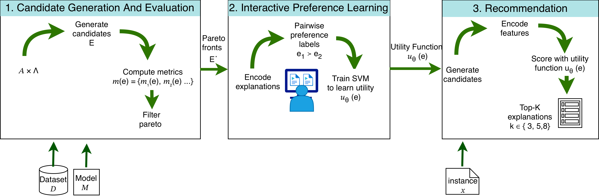

# PersoXAI

PersoXAI is a framework for generating, evaluating, and personalizing explanations of model predictions. It surfaces multiple explanation methods for each instance, lets people pick the ones they find most useful, and ultimately aims to learn a latent explanation ranker that can proactively recommend explanations aligned with each individual’s preferences.



## Project Overview

1. Train or load a predictive model and run a suite of explainers on tabular datasets.  
2. Present the resulting local explanations to human participants so they can label or rank their preferred styles.  
3. Use those interactions to fit a ranker that maps context (model, instance, user) to the explanation style most likely to satisfy that person.

## Preference-Learning Pipeline (metadata → encoding → meta-learning)

The typical flow is:

1) run explainer experiments → 2) compute Pareto fronts → 3) encode features → 4) run preference learning.

### 1) Run experiments (metrics + explanations)

All experiment outputs are written under `results/<RUN_ID>/...` (metrics, detailed explanations, logs, etc.).

**PersoXAI search space (grid over explainer hyperparameters)**  
Uses the standard suites (e.g. `openml_*_suite`) which expand explainers into a full grid from `src/configs/explainer_hyperparameters.yml`.

```bash
# Example: run a grid over SHAP/LIME/IG/CausalSHAP variants
RUN_ID="persoxai_grid_$(date +%Y%m%d_%H%M%S)"
SUITES="openml_bank_suite openml_german_suite open_compas_suite" \
MODELS="decision_tree mlp_classifier gradient_boosting logistic_regression" \
JOBS=1 \
./run_local_jobs.sh "$RUN_ID"
```

**AutoXAI search space (Bayesian optimization / GP)**  
Uses the AutoXAI suites (e.g. `autoxai_*_suite`) where explainers have `randint` ranges and are optimized sequentially via `explainer_hpo` in `src/configs/experiments.yml`.

```bash
RUN_ID="autoxai_gp_$(date +%Y%m%d_%H%M%S)"
SUITES="autoxai_openml_bank_suite autoxai_openml_german_suite autoxai_open_compas_suite" \
MODELS="decision_tree mlp_classifier gradient_boosting logistic_regression" \
JOBS=4 \
./run_local_autoxai_all.sh "$RUN_ID"
```

Note: `run_local_autoxai_all.sh` currently contains a hard-coded `RUN_ID` override for testing; remove/disable it if you want the CLI argument (or generated default) to take effect.

Tip: if you want all artifacts (grid + AutoXAI) under the same run folder, reuse the same `RUN_ID` in both commands.

### 2) Generate Pareto fronts

Once all experiment runs finish, generate Pareto fronts from the metric JSONs:

```bash
# args: [metrics_dir] [output_dir] [optional target_path]
./generate_pareto_front.sh \
  "results/<RUN_ID>/metrics_results" \
  "results/<RUN_ID>/pareto_fronts_new"
```

If your metrics live elsewhere, pass the correct directories (or set `RESULTS_ROOT` before running the script).

### 3) Encode features (this completes the encoding step)

Use the wrapper in `encode.sh` (it runs metadata generation + feature encoding):

```bash
# args: [pareto_dir] [metadata_dir] [encoded_dir]
./encode.sh \
  "results/<RUN_ID>/pareto_fronts_new" \
  "results/<RUN_ID>/metadata" \
  "results/<RUN_ID>/encoded_pareto_fronts_new/features_full_lm_stats"
```

### 4) Preference learning + evaluation

Run preference learning (and AutoXAI comparison runs) together:

```bash
RESULTS_ROOT="results/<RUN_ID>" \
ENCODED_DIR="results/<RUN_ID>/encoded_pareto_fronts_new/features_full_lm_stats" \
./src/preference_learning/launcher.sh
```

By default, preference learning runs exclude the `statistical` and `landmarking` feature groups:

```bash
--exclude-feature-groups statistical landmarking
```

Even though the pipeline can compute dataset-level statistical metadata and landmarking signals, in our current experiments these groups do not improve downstream preference-learning performance, so we ignore them to keep the feature space smaller and training faster. If you want to include them, remove the `--exclude-feature-groups` flag in `src/preference_learning/launcher.sh` (or in your manual `python3 -m src.preference_learning.run_all ...` invocation).

For AutoXAI-search-based comparison only, use `src/preference_learning/run-auto-xai-comparison.sh` (it’s a runnable command; update the hard-coded paths inside if needed).

The runner pulls the dataset/model/explainer/metric configs from `src/configs/*.yml`, instantiates everything, and attaches both per-instance and batch metrics using the capability metadata each evaluator now exposes.
